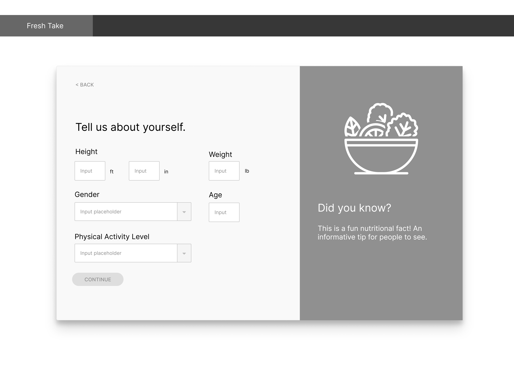
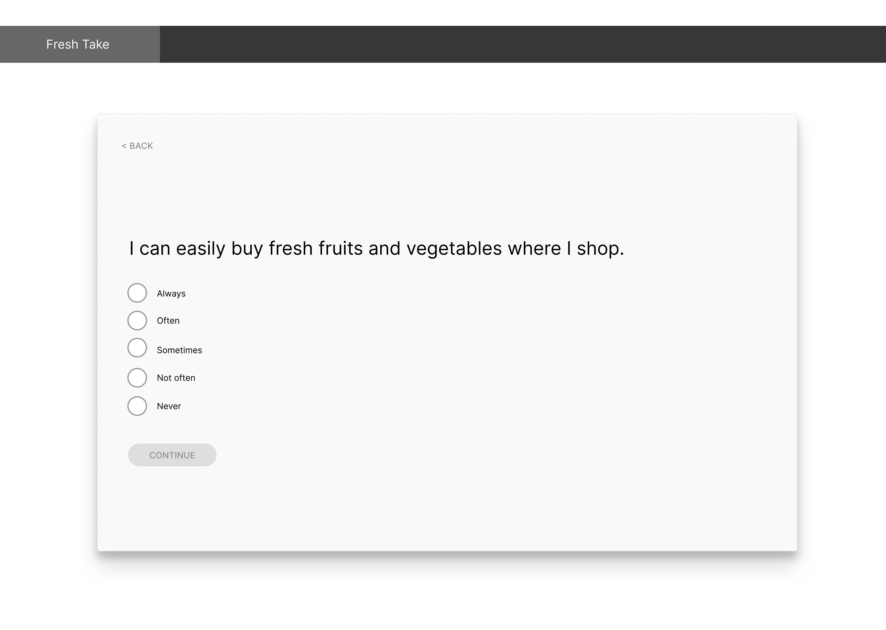

# Problem Statement

While information surrounding nutrition might appear as prominent as ever due to technology and communication platforms, lack of accurate, personalized nutrition information continues to predominantly impact teenagers and young adults in minority communities. Without adequate access to nutritional education and healthy diet, low-income communities of color encounter greater disparities in quality of life, lifespan, and/or disease incidences[[1]](https://www.ncbi.nlm.nih.gov/pmc/articles/PMC2729116/). A couple user interviews from individuals of these communities and with Public Health backgrounds reveal that main causes of the problem root from lack of time to sift through nutritional information suited for their needs, as many are busy with other pressing needs such as work to sustain their income. Additionally, for both busy individuals and teenagers, some nutritional content is not as accessible such as the language of lengthy, difficult academic sources, leaving minimal options for visually understandable and concise information.

While there are existing solutions to address accurate nutrition information and meal plans, like nutrition.gov and ChooseMyPlate, their information is not fully personalized towards an individual’s current situation and demographic, such as culturally competent and affordable options that communities of color may feel more personally connected to. Given this current context, how might we bring accurate, straightforward, and personalized nutrition information for underrepresented minority teenagers/young adults to improve knowledge on nutritious habits?

# Solution Statement

## Overview of Fresh Take ##
Our solution supports teenagers and young adults in minority communities who may have limited experience in building nutritious habits and lifestyles, but would like to learn more. This is implemented in a form of a personalized plan where a user submits their information in an engaging survey, which is then calculated to provide nutritional recommendations, curated nutrition tips, and culturally relevant meals. The web application interface is as follows:

Figma Link:    [Fresh Take](https://www.figma.com/file/0rxNfC7CmNp9xTu8dCy3Q0/INFO-442-Design?node-id=12380%3A0)
  

### Landing Page ###

 __Navigation Bar:__
The nav bar is shown on every screen of the interface. The Fresh Take logo is contained in its own box, hyperlinked to this landing page URL. For the About and Project Menu tabs, each tab container should be highlighted when hovering over it.

__Create Plan banner card:__ Card should be responsive to size changes, but should still have the photo/text (“Personalize your nutrition…” above the Create Plan button at all times. Only the Create Plan button should be clickable, and it will lead you to the first page of the survey.

__Info/quote/testimonial cards:__ On desktop port these cards should be aligned horizontally, but when reducing the viewport on a smaller device the cards may be stacked vertically. Photos should be included on the top part of the card, but if there is no photo the card will default to a preselected blank placeholder. It should be view-only and not clickable.
Popular meal cards: A maximum of 6 popular meals should be shown on the home page at once. If a user wants to see more meals, they can click the Popular Meals tab in the nav bar or a Show More button that will be designed at the bottom of the 6 meal previews to redirect to the Popular Meals page. Each meal card redirects to an external hyperlink showing the recipe.
  
__Popular meal cards:__ A maximum of 6 popular meals should be shown on the home page at once. If a user wants to see more meals, they can click the Popular Meals tab in the nav bar or a Show More button that will be designed at the bottom of the 6 meal previews to redirect to the Popular Meals page. Each meal card redirects to an external hyperlink showing the recipe.
### Create Plan Survey ###
  

__Name__  
After selecting the Create Plan button on the landing page, the user is directed into a new page in a slideshow card modal display. A user may enter their name in the input box. If no input is entered, the box is blank and the Continue button is disabled and they will not be able to proceed forward. The user can click on the left Back button at any time, and on this first slide the Back button will lead them back to the landing page. On the bottom is a progress bar that increases each time to press Continue to go to the next question, proportional to the amount of questions the survey has.
### Tell Us About Yourself ###
  
Height, age, and weight are all text entry inputs that require a number. If an alphabetical character is inputted in any of these, an error message pops up right above the Continue button that says “Enter a number for one of your inputs.” Physical activity level is a drop down with the options “Little to no activity,” “Moderate activity,” “High activity.” If one of the inputs are empty (excluding the input next to “in” for Height), then the Continue button is disabled. Pressing the back button will not store any of the correct information and then go back to the previous slide (Name).

Height, age, and weight information will be stored into an equation that calculates the recommended calorie amount and food portion sizes provided to the user after completing the survey. Physical activity level will also be calculated with height, age, and weight into an equation that suggests the minutes of physical activity.
### Budget ###
  
User can input their maximum weekly budget by clicking and dragging on the slider scale. The slider placement should also show the number it is on below the slider square. The continue button does not have a disabled state and is active at all times--if the user does not move the slider the default will be at $0.

If the user inputs $60 or less, it will signal on the back end to populate a list of pre-made resources for budgeting (such as a budget track sheet and/or relevant affordable food options), which is provided after the survey for curated nutrition tips/resources.
### Accessible Foods ###
  
The user may input one option using the radio buttons. If no options are selected/it is empty, the continue button is disabled. If a user selects “extremely inaccessible” or “inaccessible,” then it will signal on the backend to draw from the list of recipes that are labeled as “accessible”--meaning that the ingredients use/are able to be substituted for alternatives like canned vegetables or other staple foods. (The meals and recipes will be stored in a database with tags that label its contents such as accessibility).
### Cuisine ###
  
A user can select as many options as they want for their cuisine choices. The empty state starts with 0 selected (outlined and no fill pill). The Continue button is active at all times--if a user continues without selecting any, the meal and nutrition options will be randomly selected for them in the plan in the results page. If a user selects 1 or more options, all meals tagged under the selected categories (e.g. Southern cuisine) will be shown to them under the recommended meals in the results page.
### Goal-Setting ###
  
The user may input one option using the radio buttons. This is the last question, and when the user reaches the last question slide the button is labeled as Submit. If no options are selected/it is empty, the Submit button is disabled.

If they select “Extremely prefer goal setting with others” or “Prefer goal setting with others,” it will signal to get the list of tips and/or resources that are tagged with “group goal-setting advice.”  For example, the results page will provide a resource that allows you to set a smart goal that keeps you accountable with a friend. If they select “Prefer goal setting with myself” or “Extremely prefer goal setting with myself,” it will pull from the tips/resources tagged on personal goal-setting advice” that will show on the results page. Selecting “neutral” will randomize the resources and tips with either group and personal topics.
### Loading Results ###
  
After submission, a loading screen will appear with an animated loading graphic for approximately 3 seconds. The user will not be able to input anything on this slide except for the back button, where they can re-enter any previously saved information before submitting again. This should pull up on the personalized resources and meals that were tagged based on the relevant responses submitted before, in addition to finalizing the calculations from the user’s personal information.
### Results ###
  
Name: From the submitted name that the user provides, call in the input to replace {name}.

__Recommendations:__ All calories, serving sizes of fruits and vegetables, cups of water, and exercise should be calculated from the personal information of weight, age, height, and physical activity. Each calculation is based on a separate equation that will be used from existing research/calculations around nutritional standards.

__Curated nutrition tips for you:__ Advice and resources personalized to the user are provided here. This includes information submitting on goal setting preferences in addition to the budget question. For example, if the user qualifies for the budget number cutoff, there will be resources linked around the topic, in addition to tagged advice tips surrounding budgeting with food. The resource cards below the pre-written advice tips hyperlink to external sources, or are attachments that they can read and use.

__What others with similar results are doing:__ These are list items or quotes from other users on tips and habits they are currently doing to improve their nutrition habits. These are based on the responses on the goal setting and accessible food questions. A list of quotes tagged on “group goal,” “personal goal,” or “accessible” is pulled based on these answers and will provide relevant wording towards the user’s needs.

__Suggested meals:__ Suggested meals list a range from 3 - 6 cards curated from their preferences picked in the Cuisine question. If they selected that their food and vegetables were not accessible, the recipes that are tagged as “accessible” should only appear here as well. At the bottom of the card gallery should be a “Show All Meals” button that redirects them to the “Popular meals” page. All cards should be linked to external hyperlinks verified by our project team.
### Popular Meals ###
  
Popular meals can be accessed from the Nav Bar, or in any of the buttons on pages that say to Show All Meals. When the user visits this page, the Popular Meals tab should be highlighted to distinguish its location. All meals are organized into cards that hyperlink to external sites. These should be categorized into sections of each cultural cuisine in alphabetical order.

Wording on each card should list the recipe name as the title, and a 1 sentence description underneath. All cards should be equal height--so any long names or descriptions are clipped.
### About Us ###
  
About Us page is accessed by clicking About on the Nav Bar, and the tab is highlighted when the page is visited. This is primarily a read-only page with text blurbs of creators and profile photos.
